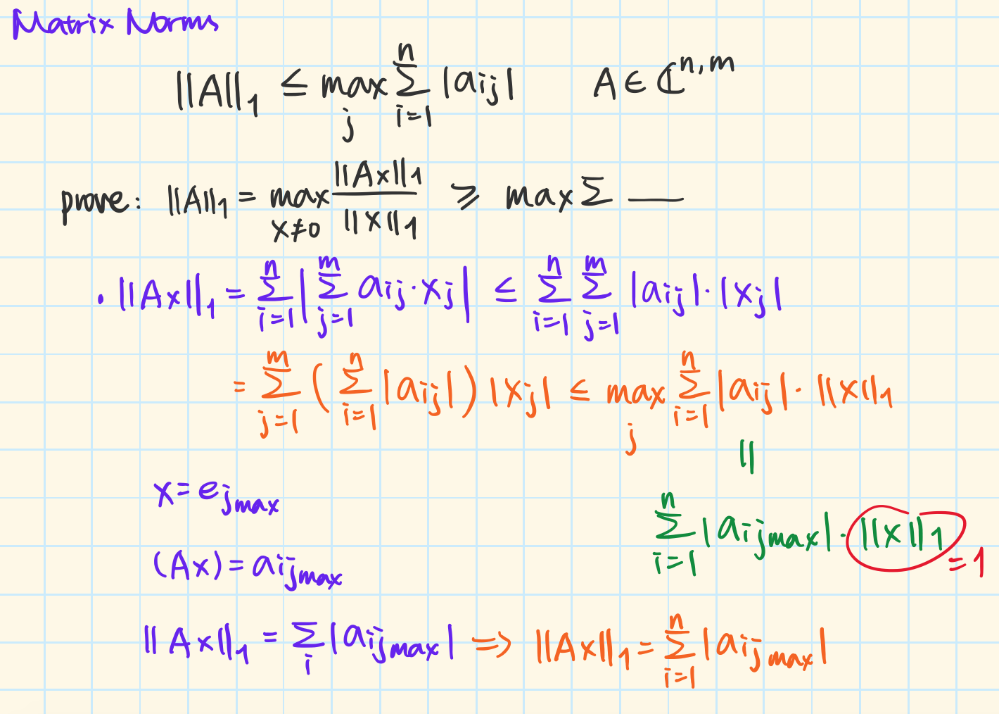

* content
{:toc}

# Identity Matrix

 
**Unit Vector.** We represent the unit vectors by $$ \mathbf{e}_{j} \in \mathbb{C}^{n} $$ where the *j* th element of $$ \mathbf{e}_{j} $$ is 1 and all other elements are zero. $$ \mathbb{C} $$ represent the *Complex Number* since actually vectors are complex number. $$ n $$ represent the dimension of the vector space.
 
<!--more-->
Unit vectors may be used to represent the axes of a Cartesian coordinate system. For instance, the unit vectors in the direction of the *x*, *y*, and *z* axes of a three dimensional Cartesian coordinate system are: 

$$ \hat{\mathbf{i}}=\left[\begin{array}{l}{1} \\ {0} \\ {0}\end{array}\right], \hat{\mathbf{j}}=\left[\begin{array}{l}{0} \\ {1} \\ {0}\end{array}\right], \hat{\mathbf{k}}=\left[\begin{array}{l}{0} \\ {0} \\ {1}\end{array}\right] $$

  
**Identity Matrix.** The identity matrix is given by $$ \mathbf{I} \in \mathbb{C}^{n, n} $$. The row $$ i $$, column $$ j $$ entry of $$ \mathbf{I} $$ is:  

$$ \mathbf{I}_{i, j}=\left\{\begin{array}{ll}{1} & {\text { if } i=j} \\ {0} & {\text { otherwise }}\end{array}\right. $$

 
The $$ j $$ th column of  $$ \mathbf{I} $$ is $$ \mathbf{e}_{j} $$, for example, if $$ n=2 $$: 

$$ \mathbf{I}=\left[\begin{array}{l}{1}&{0} \\ {0}&{1}\end{array}\right], \mathbf{e}_{1}=\left[\begin{array}{l}{1} \\ {0}\end{array}\right], \mathbf{e}_{2}=\left[\begin{array}{l}{0} \\ {1}\end{array}\right] $$

   
# Hermitian Transpose

 
**Hermitian Transpose.** Consider a matrix $$ \mathbf{A} \in \mathbb{C}^{n, n} $$, with entries $$ A_{i, j} $$. The matrix $$ \mathbf{A}^{*} \in \mathbb{C}^{n, n} $$, with entries $$ \left(A^{*}\right)_{i, j}=\overline{A_{j, i}} $$ is called the **Hermitian Transpose** of $$ A $$, where $$ \overline{x+i y}=x-i y, x, y \in \mathbb{R} $$(get the negative of the **imaginary part** of the vector). It is sometimes donated as $$ \mathbf{A}^{H} $$.
 
In fact, $$ \mathbf{A}^{*}=\overline{\mathbf{A}}^{T}=\overline{\mathbf{A}^{T}} $$, where $$ \mathbf{A}^{T} $$ is the usual matrix transpose $$ \left(A^{T}\right)_{i, j}=A_{j, i} $$.
 
e.g.: 

$$ \mathbf{A}=\left[\begin{array}{l}{3+i}&{5} \\ {2-2i}&{i}\end{array}\right], \mathbf{A}^{*}=\left[\begin{array}{l}{3-i}&{2+2i} \\ {5}&{-i}\end{array}\right] $$

   
# Non-Singular

 
**Matrix Inverse.** Consider a matrix $$ \mathbf{A} \in \mathbb{C}^{n, n} $$, if there is a matrix $$ \mathbf{Z} \in \mathbb{C}^{n, n} $$ such that $$ \mathbf{A}\mathbf{Z} = \mathbf{I} \in \mathbb{C}^{n,n} $$ then $$ \mathbf{Z} $$ is the inverse of $$ \mathbf{A} $$ and is written as $$ \mathbf{A}^{-1} $$.
 
**Non-Singular.** A matrix $$ \mathbf{A} \in \mathbb{C}^{n, n} $$ is *non-singular* or *invertible* if there is a matrix $$ \mathbf{Z} \in \mathbb{C}^{n, n} $$ such that $$ \mathbf{A}\mathbf{Z} = \mathbf{I} \in \mathbb{C}^{n,n} $$.  
Simply, ff the result of matrix multiplication of two matrix is a **identity matrix**, these two matrix are *invertible matrix*, and **non-singular matrix**. 
If $$ \mathbf{A} $$ is non-singular then $$ \mathbf{A}^{-1} $$ exists and $$ \mathbf{A}x = b $$ **always has an unique solution** $$ x = \mathbf{A}^{-1}b $$.
   
# Singular Value vs Eigenvalue

 
building...
   
# Linear Independence

 
Let $$ \left\{\mathbf{v}_{1}, \mathbf{v}_{2}, \mathbf{v}_{3}, \cdots, \mathbf{v}_{k}\right\} $$ be a set of vectors.
 
**Linear (In)dependence.** The set is said to be **linearly dependent** if there are $$ c_{1}, c_{2}, \cdots, c_{k} $$(not all zero) with 

$$ 0=c_{1} \mathbf{v}_{1}+c_{2} \mathbf{v}_{2}+\cdots+c_{k} \mathbf{v}_{k} $$
 
A set of vectors that is **not** linearly dependent is called **linearly independent**.
   
# Range, Nullspace and Rank

 
building...
   
# Norms

 
**Norms.** We use a **norm** to measure the distance between $$ \mathbf{x} $$ and $$ \widehat{\mathbf{x}} $$, which approximates $$ \mathbf{x} $$.
 
**p-norms.** 

$$ \|\mathbf{x}\|_{p}=\left(\sum_{i=1}^{n}\left|x_{i}\right|^{p}\right)^{\frac{1}{p}} $$
 

* 1-norm(Manhattan Distance) 

$$ \|\mathbf{x}\|_{1}=\left(\sum_{i=1}^{n}\left|x_{i}\right|\right) $$
 

Points on this square has an equal distance from the center. The L-1 norm is formally defined as the sum of the absolute value of the difference in each coordinate between two vectors.

* 2-norm(Euclidean Distance) 

$$ \|\mathbf{x}\|_{2}=\left(\sum_{i=1}^{n}\left|x_{i}\right|^{2}\right)^{\frac{1}{2}}=\sqrt{\left(\mathbf{x}^{*} \mathbf{x}\right)} $$
 

Euclidean distance allows us to take straight-line paths from point to point, allowing us to reach further into the corners of the L-1 diamond.

* $$ \infty $$ -norm 

$$ \|\mathbf{x}\|_{\infty}=\max _{i}\left\{\left|x_{i}\right|\right\} $$
 

The L-$$ \infty $$ norm is equivalent to the maximum absolute dimension in the distance between two points. As the reciprocal power is taken, only the that largest difference remains. So, in a difficult, infinite way, it simply chooses the maximum.
 
 
For more information about the L1 and L2 distance in machine learning: [Nearest Neighbor Classifier](https://suikei-wong.github.io/2019/06/28/cs231n-Image-Classification-&-Linear-Classification-&-Loss-Function).
  
**Vector Norms(L1,L2...are vector norms).** If $$ \mathbf{x} $$ and $$ \mathbf{y} $$ are vectors, then $$ \|\cdot\| $$ is a vector norm if all of the following properties hold($$ \alpha $$ is a scalar);
* $$ \|\mathbf{x}\|>0 $$, if  $$ \mathbf{x} \neq 0 $$
* $$ \|\alpha \mathbf{x}\|=| \alpha\| \| \mathbf{x} \| $$ 
* $$ \|\mathbf{x}+\mathbf{y}\|\leq\|\mathbf{x}\|+\|\mathbf{y}\| $$
  
**Matrix Norms.** Given a vector norm $$ \|\mathbf{x}\| $$, we can define the corresponding *matrix norms* as follows: 

$$ \|\mathbf{A}\|=\max _{\|\mathbf{x}\| \neq 0} \frac{\|\mathbf{A} \mathbf{x}\|}{\|\mathbf{x}\|} $$

which are **subordinate** to the vector norms: a matrix norm is a vector norm in a vector space whose **elements (vectors) are matrices** (of given dimensions). 
For the 1-norm and $$ \infty $$ -norm: 
$$ \|\mathbf{A}\|_{1}=\max _{j} \sum_{i=1}^{n}\left|a_{i j}\right| $$  
**(column vector)**: sum up the absolute value of each element in the $$ j $$ th column and get the maximum.  
$$ \|\mathbf{A}\|_{\infty}=\max _{i} \sum_{j=1}^{n}\left|a_{i j}\right| $$  
**(row vector)**: sum up the absolute value of each element in the $$ i $$ th row and get the maximum.  
So if $$ \mathbf{A} $$ and $$ \mathbf{B} $$ are matrices, then $$ \|\cdot\| $$ is a matrix norm if all of the following properties hold($$ \alpha $$ is a scalar)(similar to the *vector norms*): 
* $$ \|\mathbf{A}\|>0 $$, if $$ \mathbf{A}\neq 0 $$ 
* $$ \|\alpha \mathbf{A}\|=|\alpha|\|\mathbf{A}\| $$
* $$ \|\mathbf{A}+\mathbf{B}\| \leq\|\mathbf{A}\|+\|\mathbf{B}\| $$ 

As the subordinate matrix norms defined above, *matrix norms* also have the follwing additional properties: 
* $$ \|\mathbf{A B}\| \leq\|\mathbf{A}\|\|\mathbf{B}\| $$
* for any vector $$ \mathbf{x} $$, $$ \|\mathbf{A} \mathbf{x}\| \leq\|\mathbf{A}\|\|\mathbf{x}\| $$ 

Proof of this: 

